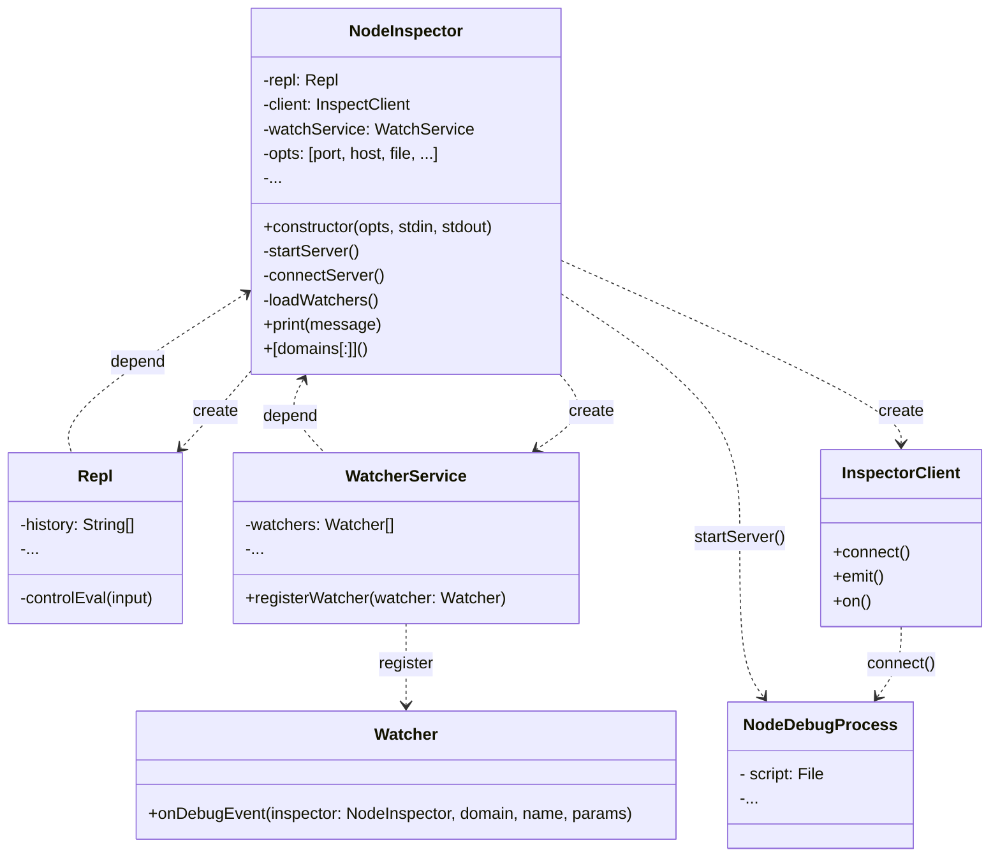

# ndx
extended node debugger server and client cli on v8 debugger protocol

## demo


## features
- able to register watchers to automate the debugging process 
- ```Watcher#onDebugEvent``` interface returns inspector object based on [v8 debugger protocol](https://chromedevtools.github.io/devtools-protocol/v8)
- watcher enables to blackbox and stepover the custom or internal scripts when stepping and trace function calls and variables
- separated server executable and client cli makes debugging dockerized node app possible 

## install
```bash
yarn global add ndx

# launch debug server
ndx -s -h localhost -p 3000 $APP 

# launch as debug cli client with watchers
ndx -c -h localhost -p 3000 -w $WATCHERS_FILE
```

## examples
- watcher samples are located at ${PACKAGE_ROOT}/watcher-samples

```bash
cd $PACKAGE_ROOT

# test server
./cli.js -s -h localhost -p 3000 ./app-sample 

```

```bash
# test client
./cli.js -c -h localhost -p 3000 -w ./watcher-samples/index.js

ndx> pause

ndx> next

# debug APIs
ndx> help
```

- watcher class structure
```js
class VariablesWatcher extends Watcher {
    onDebugEvent(inspector, domain, name, params, nextWatcher) {
        if (domain == 'Runtime') {
            this.log('I am watching runtime domain calls');
        }
        nextWatcher();
    }
}
```

## debug APIs
- protocol method calls are defined on the inspector object returned by ```Watcher#onDebugEvent``` interface, see [v8 debugger protocol](https://chromedevtools.github.io/devtools-protocol/v8)

## development
- parts of the debugger structure is referenced from [node-inspect](https://github.com/nodejs/node-inspect)  

